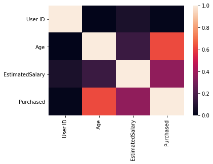
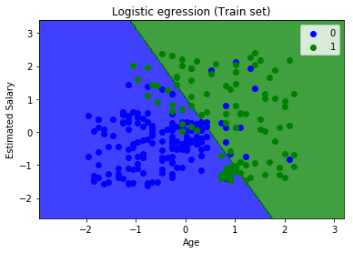
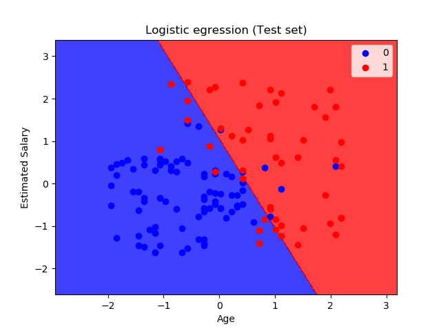

# logistic regression to predict whether an employee will purchase suv
Predicting if an employee will purchase an suv given their age and salary using Logistic Regression

## Visualizing data before processing

## visualizing the training set result

## visualizing the testing set result

## evaluating model with confusion matrix

conf_matrix = confusion_matrix(y_test,y_pred)

print(conf_matrix)

array([[79,  6],
       [11, 38]], dtype=int64)
       
## accuracy
accuracy = (79+38)/len(y_test)

print(accuracy)

0.8731343283582089

## misclassification rate
mis_cla_rate  = (11+6)/len(y_test)

print(mis_cla_rate)

0.12686567164179105
